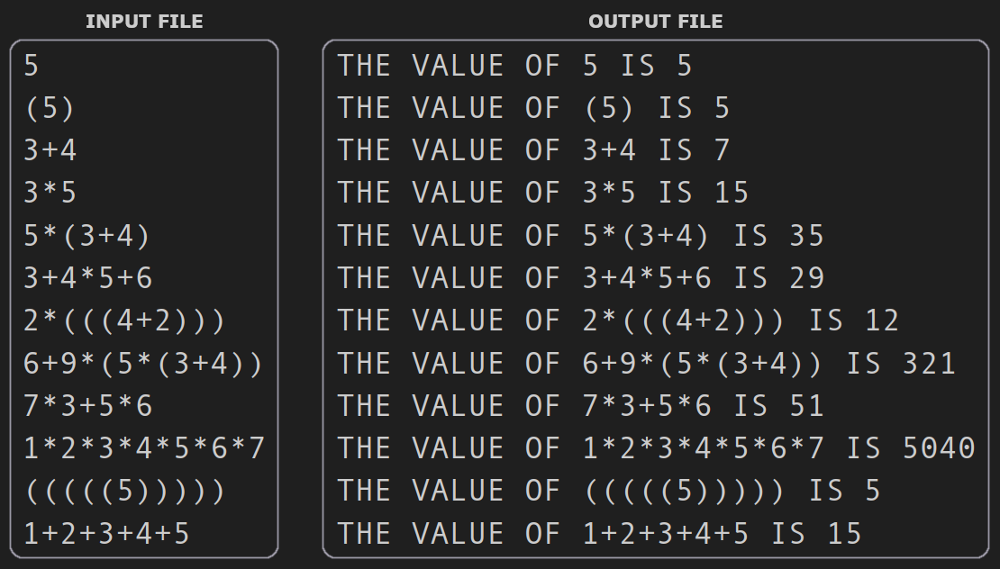

# Pascal Expression Evaluator

This was a school project that tasked us with creating an expression evaluator.



The specifics details and requirements to this project can be found in the [Assignment Outline PDF](./assignment/Pascal%20Programming%20Assignment.pdf) file.

To run this program on a Linux machine, first make sure you have [fpc](https://www.freepascal.org/) installed, then run:
```bash
    ./run.sh
```

Running this command should produce an output file defined where the **OUTPUT_FILE_PATH** constant points. A sample of this output can be found [here](./sample_output.txt)

The input and output file and directories can be configured at the top of the [Pascal source file](./main.pas).

> **Note:** This program is also able to parse both DOS and UNIX formatted text files. 

---

## LICENSE:
**Copyright Notice :copyright:**

*This project is my own work and unless authorized by me with written permission, no individual nor organization is allowed to copy or redistribute any code present in this repository for academic or other reasons.*

*The file [Pascal Programming Assignment.pdf](./assignment/Pascal%20Programming%20Assignment.pdf) file is the property of the University of Texas at Tyler, and rights pertaining to it should be inquired through the University of Texas at Tyler's Department of Computer Science.*

*To contact me, my email is tscott14+github@proton.me*

*For information to contact the UT Tyler Department of Computer Science, please visit their website [here](https://www.uttyler.edu/computer-science/).*

> The full LICENSE can be found [here](./LICENSE).
