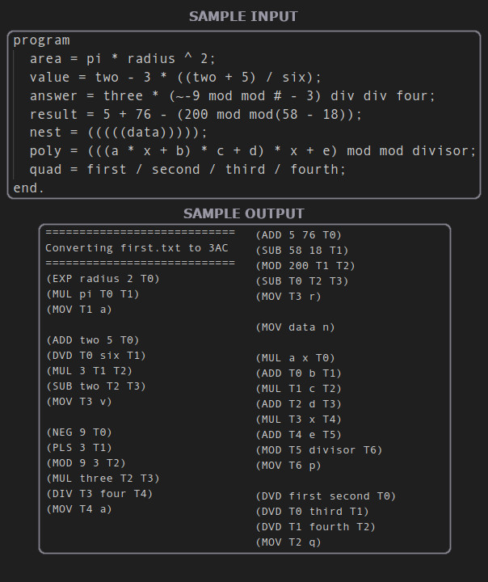

# Expression to 3AC Compiler

This project involved the transformation of multiple files, each containing numerous expressions, into a single file with their 3AC representations. Essentially, these expressions were translated into a syntax resembling assembly language. Additionally, I had the oppertunity to utilize Python, which was previously unfamiliar to me.

The Assignment's outline is currently unavailable.