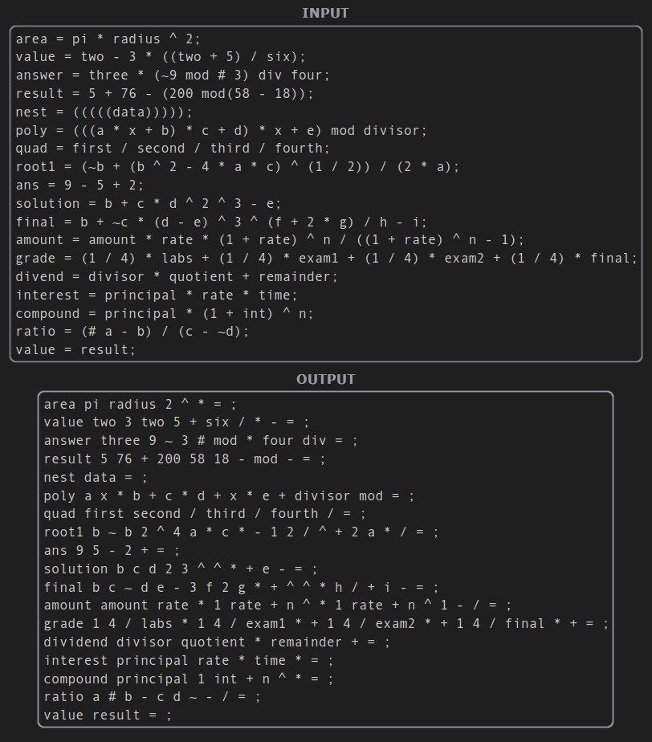

# Infix to Postfix Translator

The scope of this project necessitated the conversion of a file containing infix expressions to their corresponding postfix expressions. To accomplish this task, I had the oppertunity to utilize the Rust Language, which was previously unfamiliar to me.

The Assignment's outline is currently unavailable.